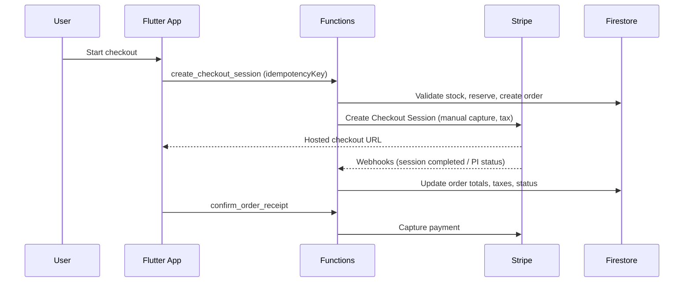

# OrignaGTA Monorepo

This repo contains:
- Flutter app: origna_gta
- Firebase Functions backend: functions

## Architecture overview
- MVVM in Flutter
- Functions own payment/shipping validation
- Idempotent payment and webhook processing

## End-to-end flow (payments)

## Quick commands
- Run all tests: scripts/run_all_tests.sh
- Flutter analyze: (cd origna_gta) flutter analyze
- Flutter tests: (cd origna_gta) flutter test
- Functions tests: (cd functions) pytest

## Docs
- App README: origna_gta/README.md
- Functions README: functions/Readme.md

## Environments
- Canada-only delivery enforced in Functions.
- Stripe Connect Express direct charges, manual capture.
