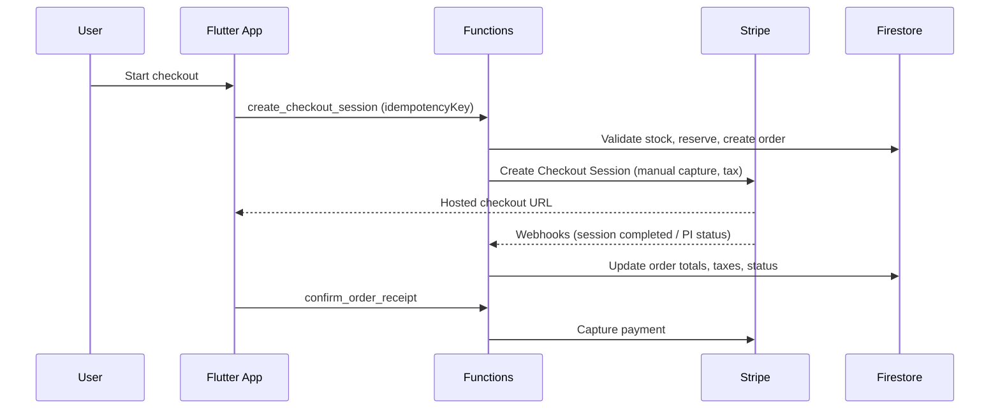

# OrignaGTA Monorepo

This repo contains:
- Flutter app: origna_gta
- Firebase Functions backend: functions

## Architecture overview
- MVVM in Flutter
- Functions own payment/shipping validation
- Idempotent payment and webhook processing
- Product ratings are submitted via Cloud Function (server-validated)

## Security hardening (2026-01-31)
**Audit Score**: 9.2/10 ✅ Production Ready | [Full Report](docs/SECURITY_AUDIT_2026_01_31.md)

- ✅ **CRITICAL**: Server-side price validation (cart items vs DB products, tolerance 1 cent)
- ✅ **CRITICAL**: Server-side shipping/tax recalculation (client values ignored)
- ✅ **CRITICAL**: Subtotal verification (1% tolerance, rejects tampering)
- ✅ **HIGH**: Authorization timeout tracking (7 days max, daily cronjob cancels expired)
- ✅ **MEDIUM**: Uniform email validation across all auth flows (no consecutive dots, strict TLD)
- ✅ **LOW**: Webhook signature errors masked in production logs
- ✅ Rate limiting: 10 req/5min per user/IP on checkout (rate_limiter.py)
- ✅ Debug prints wrapped in IS_EMULATOR checks (no sensitive data in prod logs)
- ✅ Firestore rules enforce field lengths, postal code format, and product constraints
- ✅ CSP: removed 'unsafe-eval', kept 'unsafe-inline' for Flutter Web
- ✅ Idempotent payments with client-supplied + Stripe keys
- ✅ Atomic stock transactions prevent race conditions

**Cronjobs**:
- `check_expired_authorizations_scheduled`: Daily 2 AM UTC (cancels expired payment holds)

## End-to-end flow (payments)

## Quick commands
- Run all tests: scripts/run_all_tests.sh
- Deploy Firestore rules: scripts/deploy_rules.sh
- Install pre-push hook (deploys rules): scripts/install_git_hooks.sh
- Firestore indexes: firebase deploy --only firestore:indexes
- Flutter analyze: (cd origna_gta) flutter analyze
- Flutter tests: (cd origna_gta) flutter test
- Functions tests: (cd functions) pytest

## Docs
- App README: origna_gta/README.md
- Functions README: functions/Readme.md

## Environments
- Canada-only delivery enforced in Functions.
- Stripe Connect Express direct charges, manual capture.
