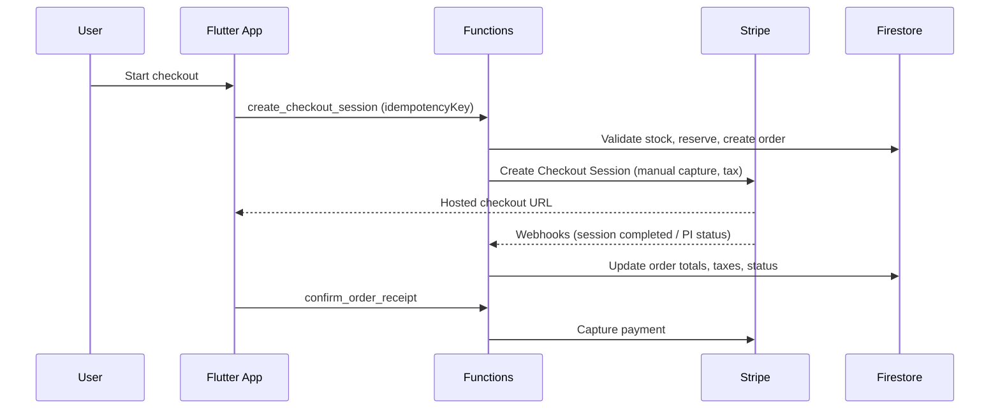

# OrignaGTA Monorepo

This repo contains:
- Flutter app: origna_gta
- Firebase Functions backend: functions

## Architecture overview
- MVVM in Flutter
- Functions own payment/shipping validation
- Idempotent payment and webhook processing
- Product ratings are submitted via Cloud Function (server-validated)

## Security hardening (2026-01-31)
**Audit Score**: 9.2/10 ✅ Production Ready | [Full Report](docs/SECURITY_AUDIT_2026_01_31.md)

- ✅ **CRITICAL**: Server-side price validation (cart items vs DB products, tolerance 1 cent)
- ✅ **CRITICAL**: Server-side shipping/tax recalculation (client values ignored)
- ✅ **CRITICAL**: Subtotal verification (1% tolerance, rejects tampering)
- ✅ **HIGH**: Authorization timeout tracking (7 days max, daily cronjob cancels expired)
- ✅ **MEDIUM**: Uniform email validation across all auth flows (no consecutive dots, strict TLD)
- ✅ **LOW**: Webhook signature errors masked in production logs
- ✅ Rate limiting: 10 req/5min per user/IP on checkout (rate_limiter.py)
- ✅ Debug prints wrapped in IS_EMULATOR checks (no sensitive data in prod logs)
- ✅ Firestore rules enforce field lengths, postal code format, and product constraints
- ✅ CSP: removed 'unsafe-eval', kept 'unsafe-inline' for Flutter Web
- ✅ Idempotent payments with client-supplied + Stripe keys
- ✅ Atomic stock transactions prevent race conditions

## Phase 3.5: Edge Case Fixes (2026-02-02)
**Status**: ✅ Complete | [Full Audit](EDGE_CASES_AUDIT.md)

**6 Critical Edge Cases Fixed**:
1. ✅ **Seller Suspension** (URGENT): `suspend_seller()` Cloud Function - auto-cancels orders, refunds buyers, restores stock
2. ✅ **Multi-Seller Capture** (URGENT): Per-seller tracking via `sellerCaptures` dict - prevents double-charging
3. ✅ **Auto-Capture Failure** (HIGH): Tracks `captureAttempts`, flags for manual review after 3 failures
4. ✅ **Rate Limiter Race** (HIGH): Transaction-based rate limiting - atomic increment prevents bypass
5. ✅ **Product Deletion** (MEDIUM): Pre-delete check for active orders - prevents stock issues
6. ✅ **Dispute Fraud** (MEDIUM): Fraud scoring system (30-90pts) - flags post-delivery disputes

**New Collections**:
- `security_alerts`: Immutable audit log for fraud/suspension events (admin read-only)

**New Order Fields**:
- `sellerCaptures`: Per-seller capture tracking
- `captureAttempts`: Auto-capture failure counter
- `requiresManualReview`: Admin intervention flag
- `fraudScore`: Dispute risk score (0-100)

**Cronjobs**:
- `check_expired_authorizations_scheduled`: Daily 2 AM UTC (cancels expired payment holds)

## End-to-end flow (payments)

## Quick commands
- Run all tests: scripts/run_all_tests.sh
- Deploy Firestore rules: scripts/deploy_rules.sh
- Install pre-push hook (deploys rules): scripts/install_git_hooks.sh
- Firestore indexes: firebase deploy --only firestore:indexes
- Flutter analyze: (cd origna_gta) flutter analyze
- Flutter tests: (cd origna_gta) flutter test
- Functions tests: (cd functions) pytest
- Configure Algolia index: Call `configure_algolia` Cloud Function (admin only)

## CI / E2E
- GitHub Actions runs backend + Flutter tests and a stable Playwright suite.
- Local E2E stack:
  - Start: `./start-e2e-services.sh`
  - Run: `(cd e2e && E2E_WORKERS=2 ./run-e2e-tests.sh flutter)`
  - Stop: `./stop-e2e-services.sh`
- Flutter web integration test:
  - Run: `./scripts/run_flutter_integration_tests_web.sh integration_test/app_test.dart`
- Playwright parallelism:
  - `E2E_WORKERS` overrides the worker count (CI uses a conservative default).
  - `E2E_PROJECT` can force a single browser project (e.g. `chromium`).

## Flutter Web performance (release checklist)
- Measure in profile mode:
  - `cd origna_gta && flutter run -d chrome --profile`
- Capture a trace in Chrome DevTools (Performance tab) on:
  - cold start (first meaningful paint)
  - home feed scroll
  - add-to-cart → checkout navigation
- Keep an eye on:
  - excessive rebuilds (Flutter DevTools)
  - large images (ensure resize/compress, cache headers)
  - expensive JSON parsing on UI thread (move to isolates if needed)

## Search Architecture (Algolia)
- **Primary Search**: Algolia for fast, typo-tolerant product search
- **Fallback**: Firestore keyword search if Algolia unavailable
- **Auto-Indexing**: Products automatically synced to Algolia via Firestore triggers
- **Credentials**: Stored in Firebase Remote Config and Google Secret Manager
  - `ALGOLIA_APP_ID` (public)
  - `ALGOLIA_SEARCH_API_KEY` (search-only, frontend-safe)
  - `ALGOLIA_WRITE_API_KEY` (backend-only, in Cloud Functions)

**Algolia Features**:
- Instant search with debouncing (500ms)
- Category filtering
- Searchable attributes: name, description, keywords
- Firestore field name: keywords (array) for both Algolia and fallback
- Custom ranking: rating → ratingCount → createdAt
- Highlighting enabled
- 20 results per page

**Setup**:
1. Add keys to `.env` and Firebase Remote Config
2. Deploy Cloud Functions: `firebase deploy --only functions`
3. Configure index settings: Call `configure_algolia` function once
4. Products auto-index on create/update/delete

## Docs
- App README: origna_gta/README.md
- Functions README: functions/Readme.md

## Environments
- Canada-only delivery enforced in Functions (buyer/shipping addresses only; sellers can be worldwide).
- Stripe Connect Express direct charges, manual capture.
- Algolia search with Firestore fallback.
