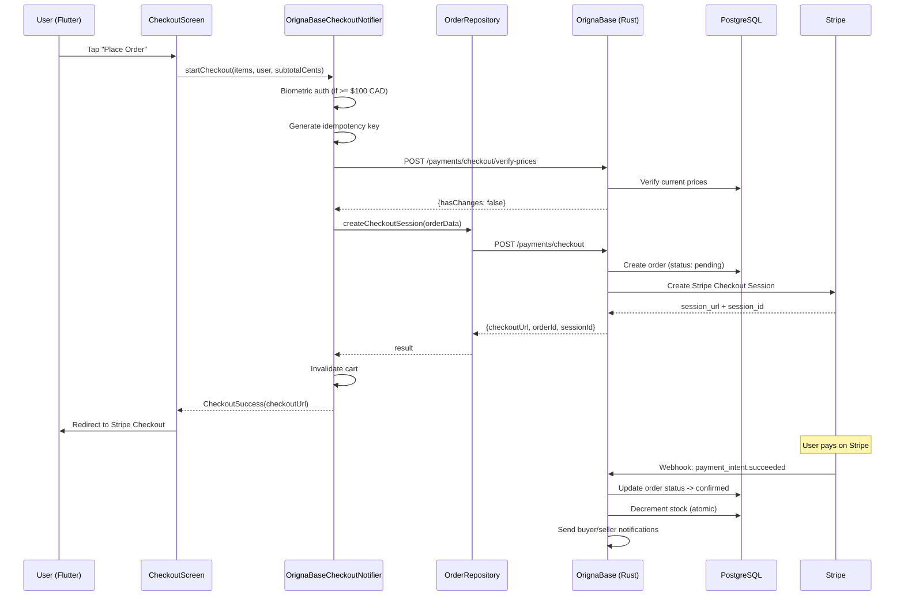
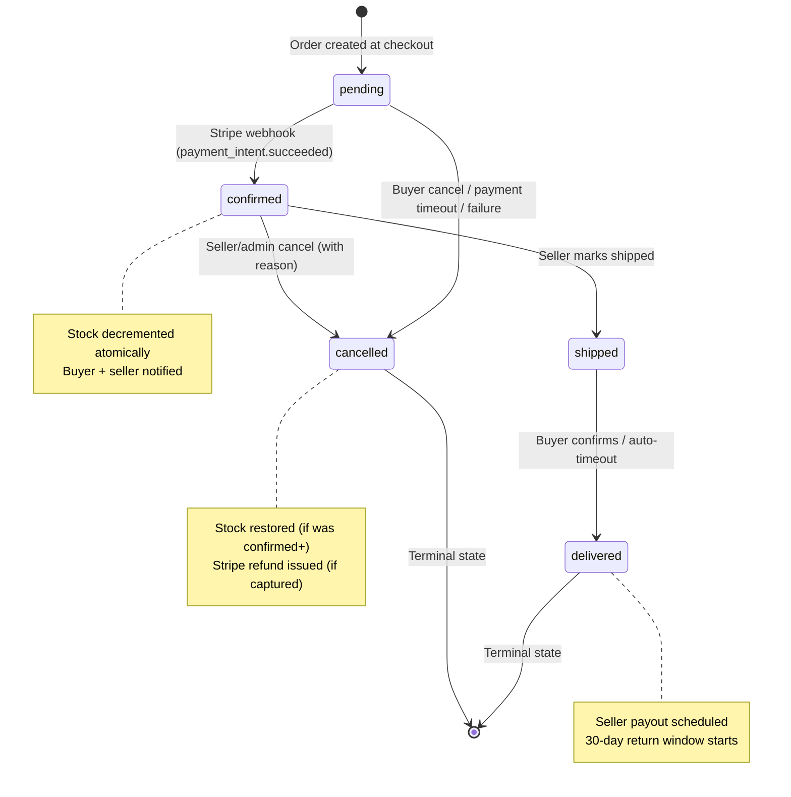
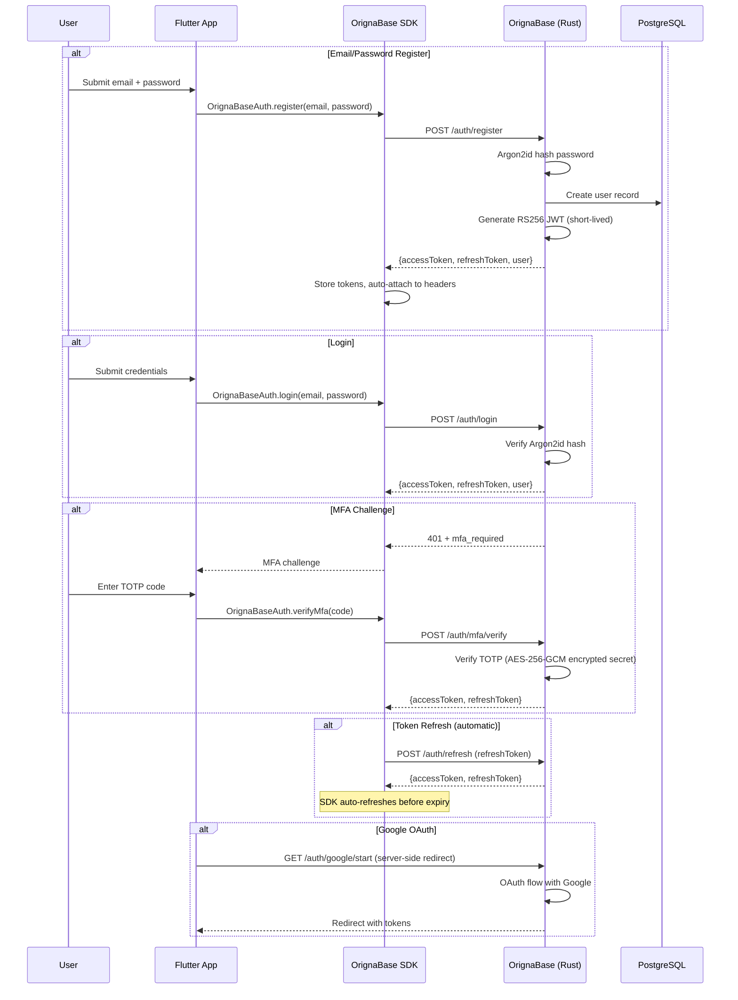

# Origna GTA -- Architecture Documentation

Last updated: 2026-03-24

---

## 1. System Overview

Origna GTA is a Canada-first multi-vendor e-commerce platform. The stack consists of three main layers:

| Layer | Technology | Location |
|-------|-----------|----------|
| **Frontend** | Flutter 3.x (Dart), Riverpod, Freezed, GoRouter | `origna_gta/` |
| **Backend** | OrignaBase (Rust), PostgreSQL, Meilisearch v1.12 | `orignabase/` |
| **Payments** | Stripe Checkout + Stripe Connect + webhooks | Backend-only |
| **Storage** | Cloudflare R2 (images/videos) | Via OrignaBase signed URLs |
| **Bot Protection** | Cloudflare Turnstile | Server-side validation |
| **Reverse Proxy** | Caddy | VPS `204.168.137.16` |

No Firebase. All auth, data, search, and storage go through OrignaBase.

### High-Level Topology

```
Flutter App (Web/Mobile)
    |
    v
OrignaBase SDK (Dart)  ----REST/GraphQL---->  OrignaBase (Rust binary)
                                                  |
                                   +--------------+---------------+
                                    |              |               |
                                 PostgreSQL   Meilisearch    Cloudflare R2
                                 (port 5432)  (port 7700)     (S3-compat)
                                   |
                              Stripe API
                          (Checkout + Connect + Webhooks)
```

---

## 2. Data Flow Diagrams

### 2.1 Checkout Flow



Key implementation: `origna_gta/lib/features/checkout/orignabase_checkout_provider.dart`

Circuit breakers wrap both shipping calculation (`ob_shipping_calc`) and Stripe session creation (`ob_stripe_checkout`) -- degraded services return user-friendly errors instead of hanging. Idempotency keys (`chk_{userId}_{uuid}`) prevent duplicate orders on retry.

### 2.2 Order Lifecycle



Valid transitions (no skips, no reversals):

| From | To | Trigger |
|------|----|---------|
| `pending` | `confirmed` | Stripe webhook `payment_intent.succeeded` |
| `pending` | `cancelled` | Buyer cancel, payment timeout, payment failure |
| `confirmed` | `shipped` | Seller action |
| `confirmed` | `cancelled` | Seller or admin (reason required) |
| `shipped` | `delivered` | Buyer confirms or auto-delivery timeout |

### 2.3 Auth Flow



---

## 3. Crate Architecture (OrignaBase Rust Backend)

The backend is a single Rust binary assembled from 15 workspace crates at `orignabase/crates/`:

| Crate | Purpose | Key Types |
|-------|---------|-----------|
| **orignabase** | Binary entry point, CLI, server assembly. Wires all crates into an Axum server. | `main()`, CLI args |
| **ob-core** | Shared config (`AppState`), error types, validation utilities. Every other crate depends on this. | `AppState`, `AppConfig`, `ObError` |
| **ob-database** | PostgreSQL client wrapper. CRUD operations, query translator (GraphQL -> SQL), transactions. | `DatabaseClient`, `Transaction` |
| **ob-auth** | Authentication: JWT (RS256/HS256), Argon2id password hashing, OAuth providers, MFA/TOTP, email verification. | `AuthService`, `JwtManager` |
| **ob-graphql** | Dynamic GraphQL schema generation from PostgreSQL tables. Auto-generates queries/mutations. | `build_schema()` |
| **ob-security** | Security rules DSL parser (pest grammar) + evaluator. Default-deny across 25+ collections. | `RulesEngine`, `evaluate_rule()` |
| **ob-realtime** | WebSocket subscriptions with change dispatch and presence tracking. | `WebSocketHandler`, `ChangeDispatcher` |
| **ob-storage** | File storage abstraction: local filesystem, S3/R2 compatible. HMAC-signed upload/download URLs. | `StorageBackend`, `SignedUrl` |
| **ob-search** | Meilisearch client with automatic index sync on document changes. | `SearchClient`, `sync_document()` |
| **ob-functions** | WASM runtime (wasmi) for server-side functions and triggers. | `FunctionRegistry`, `WasmRuntime` |
| **ob-analytics** | Privacy-first event tracking with IP hashing. | `AnalyticsService` |
| **ob-admin** | Schema management, user management, HTML admin dashboard. | `AdminRouter` |
| **ob-notifications** | FCM push notification proxy, device token management. | `NotificationService` |
| **ob-handlers** | Business logic: Stripe payments, order lifecycle, checkout, refunds, chat, product operations. | `checkout()`, `handle_webhook()`, `process_refund()` |
| **ob-mcp** | MCP server (JSON-RPC 2.0 over HTTP/SSE/stdio) with safeguards: idempotency keys, spend limits, confirmation tokens. | `McpServer`, `Tool` |

### Dependency Graph (simplified)

```
ob-handlers  ob-mcp  ob-admin  ob-notifications
    |           |       |           |
    +-----+-----+-------+-----------+
          |
    ob-auth  ob-graphql  ob-realtime  ob-storage  ob-search  ob-functions  ob-analytics
          |       |           |           |           |           |             |
          +-------+-----------+-----------+-----------+-----------+-------------+
                              |
                        ob-database  ob-security
                              |           |
                              +-----+-----+
                                    |
                                 ob-core
```

---

## 4. Common Patterns

### 4.1 Image Compression: `Future.wait` + Isolate Pattern

Product images are compressed in parallel using `Future.wait`, with each compression running in a Dart `compute` isolate. Failed compressions are silently filtered out.

**File**: `origna_gta/lib/features/products/product_image_helpers.dart` (lines 17-32)

```dart
Future<List<Uint8List>> compressProductImages(
  List<ImageModel> imageModels,
) async {
  if (imageModels.isEmpty) return [];

  final futures = imageModels.map((m) async {
    try {
      return await validateAndCompressImage(m.bytes);
    } catch (_) {
      return null;
    }
  });

  final results = await Future.wait(futures);
  return results.whereType<Uint8List>().toList();
}
```

Each image is validated (size, format), resized to max 2048px, and encoded as JPEG 85%. The caller (`AddProductViewModel.addProduct` at line 146) checks for stale request IDs after compression completes to prevent double-submit (Bug #27).

### 4.2 Pagination: N+1 Cursor Pattern

All list queries use the N+1 pattern: request `pageSize + 1` documents, use the extra to determine `hasMore`, then discard it from results.

**File**: `origna_gta/lib/core/repositories/product_search_helpers.dart` (lines 17-101)

```dart
// N+1 pattern for hasMore detection
query = query.limit(pageSize + 1);

if (lastDocumentId != null) {
  query = query.startAfterId(lastDocumentId);
}

final snapshot = await query.get();
final hasMore = snapshot.docs.length > pageSize;
final docsToMap = hasMore
    ? snapshot.docs.take(pageSize).toList()
    : snapshot.docs;
```

Returned as a `ProductQueryResult` with `products`, `lastDocumentId`, and `hasMore`. Default page size is 20.

Batch fetching by ID uses chunked `Future.wait` (chunks of 30) at line 104:

```dart
for (int i = 0; i < productIds.length; i += 30) {
  final chunk = productIds.skip(i).take(30).toList();
  final futures = chunk.map(
    (id) => ob.collection(Collections.products).doc(id).get(),
  );
  final docs = await Future.wait(futures);
  // ...
}
```

### 4.3 Error Handling: `AppError` -> SnackBar / GlitchTip

**File**: `origna_gta/lib/utils/utils.dart` (lines 852-928)

The `AppError` class provides two static methods used throughout the app:

**`AppError.getMessage(error, [fallback], [code])`** -- Extracts user-friendly messages:
- `OrignaBaseException`: returns backend message (already sanitized server-side), filters leaked DB errors
- Other exceptions: returns the fallback string, never exposes raw `e.toString()`
- Appends error codes (e.g., `[ORIGNA-PAY-001]`) for support reference

**`AppError.log(error, {stackTrace, context, extras})`** -- Dual-channel error reporting:
- Development: logs via `AppLogger.e()` (structured debug output)
- Production: sends to GlitchTip via `Sentry.captureException()` with context tags

Usage pattern in ViewModels:

```dart
} catch (e, st) {
  AppError.log(e, stackTrace: st, context: 'AddProductViewModel.addProduct');
  final msg = AppError.getMessage(e, 'product.add_product_failed'.tr());
  state = state.copyWith(isLoading: false, errorMessage: msg);
}
```

Screens consume `errorMessage` from state to show SnackBars. The `context` string enables filtering in GlitchTip dashboards.

### 4.4 Money: Integer Cents Everywhere

All monetary values use integer cents throughout the entire stack. No `double` for money -- ever.

| Layer | Field Names | Example |
|-------|-------------|---------|
| PostgreSQL | `priceCents`, `subtotalCents`, `taxAmountCents`, `totalAmountCents`, `shippingCostCents`, `platformFeeTotalCents` | `7500` = $75.00 |
| Dart models | Same field names via Freezed | `product.priceCents` |
| Stripe API | `amount` (also integer cents) | Passed directly, no conversion |
| Display layer | Division by 100 at render time | `'\$${(cents / 100).toStringAsFixed(2)}'` |

Platform fee calculation: `platformFeeTotalCents / subtotalCents` (denominator is subtotal, NOT totalAmountCents).

Free shipping threshold: `BusinessRules.freeShippingThresholdCents = 7500` ($75 CAD), checked against post-coupon subtotal.

### 4.5 Circuit Breaker Pattern

Critical external calls (shipping calculation, Stripe checkout) are wrapped in circuit breakers to prevent cascading failures.

**File**: `origna_gta/lib/features/checkout/orignabase_checkout_provider.dart` (lines 35-42)

```dart
final _shippingCircuitBreaker = CircuitBreakerRegistry.get(
  'ob_shipping_calc',
  config: CircuitBreakerConfig.searchDefault,
);
final _stripeCircuitBreaker = CircuitBreakerRegistry.get(
  'ob_stripe_checkout',
  config: CircuitBreakerConfig.paymentDefault,
);
```

When a circuit is open, the notifier catches `CircuitBreakerOpenException` and returns a user-friendly message instead of hanging.

### 4.6 Idempotency Keys

Checkout sessions use UUID-based idempotency keys (`chk_{userId}_{uuid}`) to prevent duplicate orders on retry. The server returns the existing session if the key matches (`result['duplicate'] == true`).

---

## 5. Environment Configuration

**File**: `origna_gta/lib/utils/env_config.dart`

Configuration is resolved at compile time via `--dart-define` flags:

| Environment | `--dart-define` | Web URL | API URL |
|-------------|----------------|---------|---------|
| Emulator | `ENVIRONMENT=emulator` | `http://localhost:5001` | `http://localhost:8080` |
| Dev | `ENVIRONMENT=dev` | `https://dev.orignagta.ca` | `https://api.dev.orignagta.ca` |
| Staging | `ENVIRONMENT=staging` | `https://staging.orignagta.ca` | `https://api.staging.orignagta.ca` |
| Production | `ENVIRONMENT=production` | `https://orignagta.ca` | `https://api.orignagta.ca` |

The `EnvConfig` singleton resolves the environment once and caches it. URLs are never hardcoded -- always derived from `EnvConfig.orignabaseUrl`.

R2 storage paths are namespaced by environment: `dev/products/`, `staging/products/`, `products/` (prod).

The `ORIGNABASE_URL` dart-define can override the API URL for any environment.

### VPS Setup (204.168.137.16)

Three OrignaBase instances run via Docker Compose at `/opt/orignabase/`:

| Instance | Port | Env File | PostgreSQL Database |
|----------|------|----------|--------------------|
| Production | 8080 | `.env.prod` | `main` |
| Dev | 8081 | `.env.dev` | `dev` |
| Staging | 8082 | `.env.staging` | `staging` |

Caddy handles TLS termination and reverse-proxies to the correct instance based on subdomain.

Dev has `OB_TEST_MODE=1` (disables rate limiting). Production does not.

### Stripe Configuration

| Environment | Webhook Endpoint ID |
|-------------|-------------------|
| Dev | `we_1TBt7uPPD6r8xGIz9VzZXiXP` |
| Staging | `we_1TBt8BPPD6r8xGIzSpeuwv4P` |

Test card: `4242 4242 4242 4242`. Stripe secret keys live in VPS `.env` files only -- never in source code.

---

## 6. Testing Strategy

### 6.1 Test Pyramid

| Level | Count | Location | Runs Against | Command |
|-------|-------|----------|-------------|---------|
| **Unit** | ~131 files | `origna_gta/test/unit/` | Mocked SDK | `flutter test test/unit/` |
| **Widget** | ~67 files | `origna_gta/test/widget/` | Mocked providers | `flutter test test/widget/` |
| **Screen** | ~23 files | `origna_gta/test/screens/` | Mocked providers | `flutter test test/screens/` |
| **Live Integration** | ~30 files | `origna_gta/test/live/` | Dev OrignaBase | `flutter test test/live/ --dart-define=RUN_ORIGNABASE_LIVE_TESTS=true --dart-define=ENVIRONMENT=dev` |
| **Golden** | 6 tests | `origna_gta/test/golden/` | Local renderer | `flutter test test/golden/` (excluded from CI -- renderer differs across OS) |
| **Rust Backend** | 3,208 tests | `orignabase/` | In-process | `cargo test` |
| **SDK** | 538 tests | `orignabase/sdks/flutter/orignabase/` | Mocked / Live | `flutter test` / `flutter test --tags live` |
| **E2E** | 114 specs | `e2e/` + `e2e-agent-browser/` | Dev web | `bun test specs/` |

**Total: ~8,700 tests across all layers.**

### 6.2 Quality Gates (Pre-Commit)

```bash
# Flutter (mandatory)
flutter analyze --no-fatal-infos
flutter test --exclude-tags golden

# Rust (if changed)
cd orignabase && cargo clippy -D warnings && cargo test
```

### 6.3 Coverage Targets

| Component | Target |
|-----------|--------|
| ViewModels | >= 80% line coverage |
| Services | >= 70% line coverage |
| Screens | Smoke tests required |
| Payment-critical paths | 100% branch coverage |

### 6.4 E2E Test Phases

| Phase | Files | Scope |
|-------|-------|-------|
| phase1-api | 33 | API smoke, security, data integrity, rate limiting |
| phase2-smoke | 13 | UI quality, loading/error states, accessibility |
| phase3-auth-nav | 11 | Auth flows, MFA, registration, JWT rotation |
| phase4-product-flows | 21 | Product CRUD, search, reviews, favorites, digital products |
| phase5-complex-flows | 23 | Cart, orders, seller flows, analytics, reordering |
| phase6-stripe | 13 | Payment, webhooks, subscriptions, Connect, refunds |

### 6.5 Test Accounts (Dev)

| Role | Email | Password |
|------|-------|----------|
| Admin | `e2e-admin@test.origna.ca` | `REDACTED_TEST_PASSWORD` |
| Seller | `e2e-seller@test.origna.ca` | `REDACTED_TEST_PASSWORD` |
| Buyer | `e2e-buyer@test.origna.ca` | `REDACTED_TEST_PASSWORD` |

### 6.6 Forbidden in Tests

- `print()` / `debugPrint()` -- use structured test assertions
- Real Stripe live-mode API calls
- `sleep()` / `Future.delayed()` -- use `pumpAndSettle()` or async patterns
- Hardcoded UIDs or tokens
- `test.skip` -- fix infrastructure instead
- Deleting failing tests -- fix them

### 6.7 CI/CD Pipeline

- **CI** (`ci-flutter-web.yml`): `flutter analyze --no-fatal-infos` + `flutter test --exclude-tags golden`
- **CD** (`cd-e2e.yml`): Build Flutter web -> rsync to VPS -> Run E2E suite
- Golden tests excluded from CI (Ubuntu renderer differs from macOS)

---

## Appendix: Key File Paths

| Purpose | Path |
|---------|------|
| Repo map | `docs/REPO_MAP.md` |
| Env config | `origna_gta/lib/utils/env_config.dart` |
| Schema constants | `origna_gta/lib/core/schema/schema_constants.dart` |
| Auth providers | `origna_gta/lib/core/providers.dart` |
| Design tokens | `origna_gta/lib/utils/design_tokens.dart` |
| Checkout notifier | `origna_gta/lib/features/checkout/orignabase_checkout_provider.dart` |
| Image compression | `origna_gta/lib/features/products/product_image_helpers.dart` |
| Pagination helpers | `origna_gta/lib/core/repositories/product_search_helpers.dart` |
| AppError | `origna_gta/lib/utils/utils.dart` (line 852) |
| Add product VM | `origna_gta/lib/features/products/add_product_viewmodel.dart` |
| Product repository | `origna_gta/lib/core/repositories/orignabase_product_repository.dart` |
| Rust handlers | `orignabase/crates/ob-handlers/src/` |
| Stripe webhooks | `orignabase/crates/ob-handlers/src/payments/webhooks.rs` |
| Security rules | `orignabase/crates/ob-security/` |
