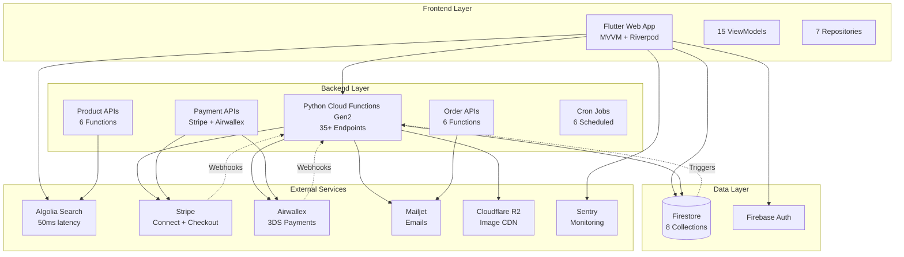
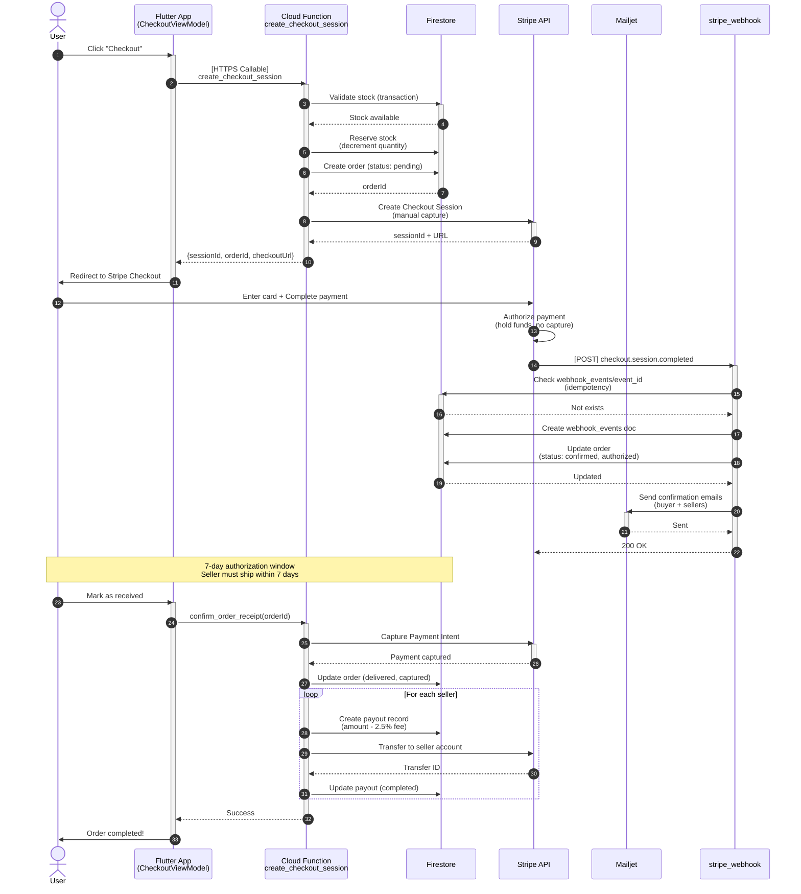
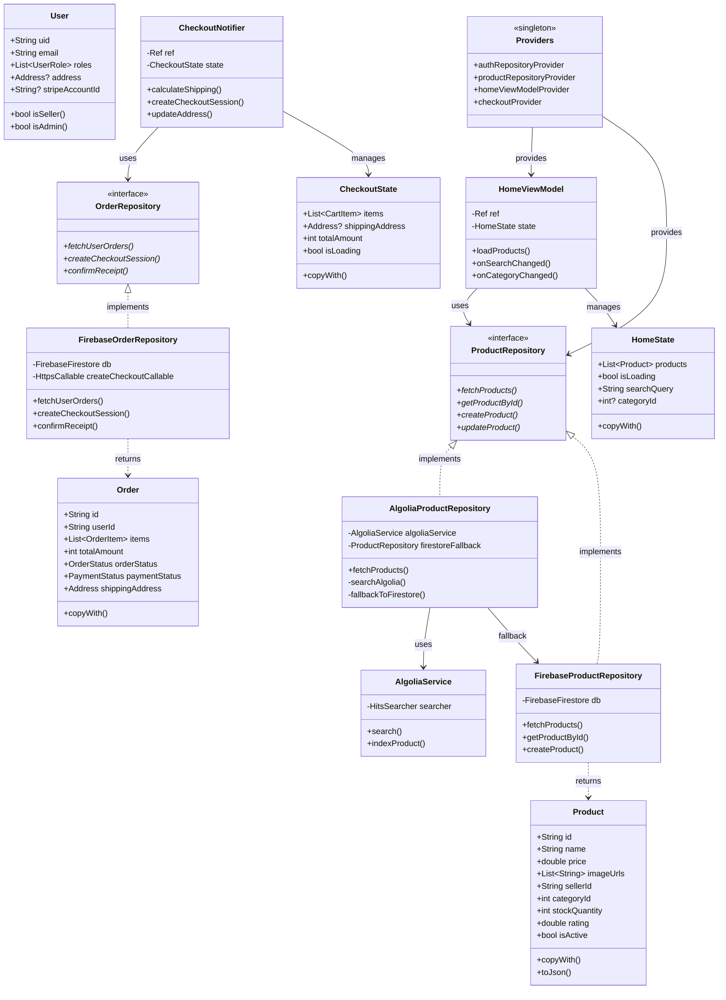
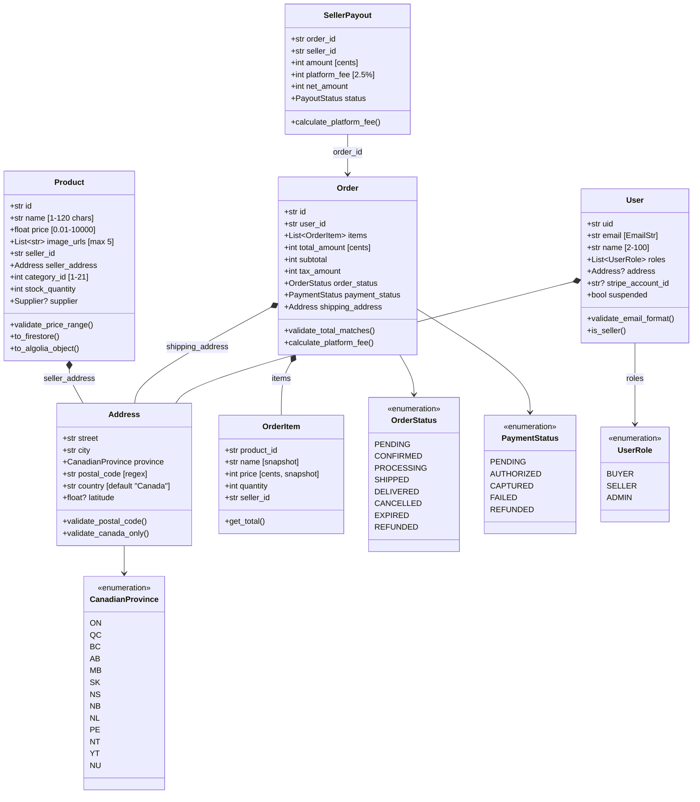
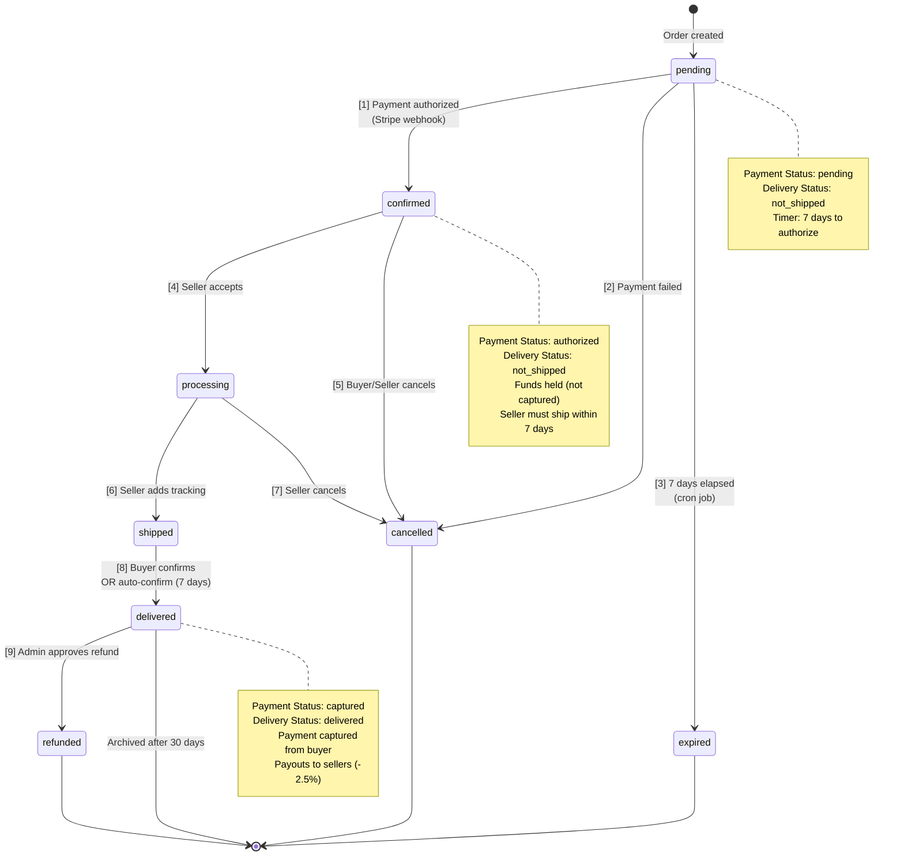
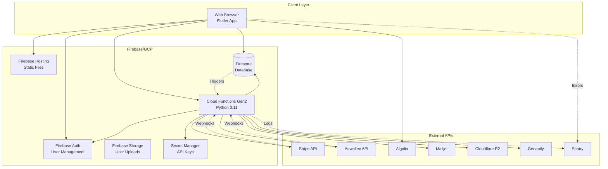

# 🏗️ OrignaGTA - Architecture & Design Documentation

> **Comprehensive UML diagrams and architectural documentation for the OrignaGTA multi-vendor marketplace platform**

**Project:** OrignaGTA Marketplace  
**Tech Stack:** Flutter Web + Firebase + Python Cloud Functions  
**Architecture:** MVVM + Repository Pattern + Riverpod State Management  
**Last Updated:** 3 février 2026

---

## 📋 Table of Contents

1. [Component Architecture](#1-component-architecture)
2. [Sequence Diagrams](#2-sequence-diagrams)
   - [Checkout Flow](#21-checkout-flow-e2e-payment)
   - [Product Search (Algolia)](#22-product-search-algolia-with-fallback)
3. [Class Diagrams](#3-class-diagrams)
   - [Frontend MVVM](#31-frontend-mvvm-architecture)
   - [Backend Pydantic Models](#32-backend-pydantic-models)
4. [Database Schema (ER Diagram)](#4-database-schema-firestore)
5. [State Machine](#5-order-lifecycle-state-machine)
6. [Deployment Architecture](#6-deployment-architecture)
7. [Security & Validation](#7-security--validation-patterns)

---

## 1. Component Architecture

### System Overview



**PlantUML Source:** [diagrams/component-architecture.puml](diagrams/component-architecture.puml)

### Technology Stack

| Layer | Technology | Version | Purpose |
|-------|-----------|---------|---------|
| **Frontend** | Flutter Web | 3.10.7 | Cross-platform UI |
| **State Management** | Riverpod | 2.6.1 | Reactive state |
| **Models** | Freezed | 2.5.7 | Immutable data classes |
| **Backend Runtime** | Python | 3.11 | Cloud Functions |
| **Validation** | Pydantic | 2.x | Type-safe models |
| **Database** | Firestore | - | NoSQL, real-time |
| **Authentication** | Firebase Auth | - | Email/OAuth |
| **Search** | Algolia | - | Typo-tolerant search |
| **Payments** | Stripe + Airwallex | - | Multi-provider |
| **Storage** | Cloudflare R2 | - | S3-compatible CDN |
| **Monitoring** | Sentry | 9.10.0 | Error tracking |

---

## 2. Sequence Diagrams

### 2.1 Checkout Flow (E2E Payment)

**Complete payment flow from cart to seller payout**



**PlantUML Source:** [diagrams/sequence-checkout.puml](diagrams/sequence-checkout.puml)

**Key Features:**
- ✅ **Server-side price validation** (prevents tampering)
- ✅ **Atomic stock reservation** (Firestore transactions)
- ✅ **Idempotent webhooks** (prevent double-processing)
- ✅ **Manual capture** (7-day authorization hold)
- ✅ **Multi-seller payouts** (2.5% platform fee)

---

### 2.2 Product Search (Algolia with Fallback)

**Fast, typo-tolerant search with automatic Firestore fallback**

```mermaid
sequenceDiagram
    autonumber
    actor User
    participant UI as Flutter UI<br/>(SearchBar)
    participant VM as HomeViewModel
    participant Repo as AlgoliaProductRepository
    participant Algolia as Algolia API
    participant Firestore as Firestore
    
    User->>UI: Types "laptops"
    UI->>UI: Debounce 500ms
    
    UI->>VM: onSearchChanged("laptops")
    activate VM
    VM->>VM: state.isLoading = true
    
    VM->>Repo: fetchProducts(query: "laptops")
    activate Repo
    
    Repo->>Algolia: POST /indexes/products/query<br/>{query, filters, typoTolerance}
    activate Algolia
    
    alt Algolia Success
        Algolia-->>Repo: {hits: [...], nbHits: 47, processingTimeMS: 52}
        deactivate Algolia
        Repo->>Repo: Convert to Product models
        Repo-->>VM: ProductResult (source: "algolia")
        
    else Algolia Failure
        Algolia-->>Repo: ❌ 503 Service Unavailable
        deactivate Algolia
        Note over Repo: Fallback mechanism activated
        
        Repo->>Firestore: Query: where('isActive', '==', true)<br/>.where('keywords', 'array-contains-any', [...])
        activate Firestore
        Firestore-->>Repo: DocumentSnapshot[] (14 products, 187ms)
        deactivate Firestore
        
        Repo->>Repo: Convert to Product models
        Repo-->>VM: ProductResult (source: "firestore_fallback")
    end
    
    deactivate Repo
    
    VM->>VM: Update state<br/>(products, isLoading = false)
    VM-->>UI: State changed
    deactivate VM
    
    UI->>User: Display products
```

**PlantUML Source:** [diagrams/sequence-search.puml](diagrams/sequence-search.puml)

**Performance Comparison:**

| Provider | Avg Latency | Features | Availability |
|----------|-------------|----------|--------------|
| **Algolia** | 50ms | Typo-tolerance, ranking, facets | 99.99% |
| **Firestore** | 200ms | Exact match, array-contains | 100% (fallback) |

---

## 3. Class Diagrams

### 3.1 Frontend MVVM Architecture

**Flutter architecture showing ViewModels, Repositories, and Models**



**PlantUML Source:** [diagrams/class-frontend-mvvm.puml](diagrams/class-frontend-mvvm.puml)

**Architecture Patterns:**
- **MVVM**: Separation of UI (View), Business Logic (ViewModel), Data (Model)
- **Repository Pattern**: Abstract data sources (Firestore, Algolia)
- **Dependency Injection**: Riverpod providers
- **Immutability**: Freezed models with `copyWith()`

**Key Components:**

| Component | Count | Purpose |
|-----------|-------|---------|
| **ViewModels** | 15 | Business logic + state management |
| **Repositories** | 7 | Data access abstraction |
| **Models** | 12+ | Immutable data classes (Freezed) |
| **Providers** | 20+ | Dependency injection (Riverpod) |
| **Screens** | 26 | UI pages |

---

### 3.2 Backend Pydantic Models

**Server-side validation and type-safe data models**



**PlantUML Source:** [diagrams/class-backend-models.puml](diagrams/class-backend-models.puml)

**Validation Examples:**

```python
# Price validation
@field_validator('price')
@classmethod
def validate_price_range(cls, v: float) -> float:
    if v < 0.01 or v > 10000.00:
        raise ValueError('Price must be between $0.01 and $10,000')
    return v

# Canada-only validation
@field_validator('country')
@classmethod
def validate_canada_only(cls, v: str) -> str:
    if v not in ['Canada', 'CA']:
        raise ValueError('Only Canadian addresses allowed')
    return 'Canada'

# Postal code regex
@field_validator('postal_code')
@classmethod
def validate_postal_code(cls, v: str) -> str:
    pattern = r'^[A-Z]\d[A-Z] ?\d[A-Z]\d$'
    if not re.match(pattern, v.upper()):
        raise ValueError('Invalid Canadian postal code')
    return v.upper()
```

---

## 4. Database Schema (Firestore)

### ER Diagram

```mermaid
erDiagram
    users ||--o{ products : "sellerId"
    users ||--o{ orders : "userId (buyer)"
    users ||--o{ payouts : "sellerId"
    users ||--o{ cart : "owns (subcollection)"
    users ||--o{ favorites : "owns (subcollection)"
    
    products }o--|| categories : "categoryId"
    products ||--o{ order_items : "snapshot in order"
    
    orders ||--|{ order_items : "contains"
    orders ||--o{ payouts : "generates"
    
    webhook_events }o--|| orders : "processes"
    security_alerts }o--o{ users : "monitors"
    rate_limits }o--|| users : "tracks"
    
    users {
        string uid PK "Firebase Auth UID"
        string email UK "RFC 5322"
        string name
        array roles "admin, seller, buyer"
        map address "Address object"
        string stripeAccountId "nullable"
        boolean onboardingCompleted
        boolean suspended
        timestamp createdAt
    }
    
    products {
        string id PK "auto-generated"
        string name "max 120 chars"
        number price "CAD 0.01-10000"
        array imageUrls "max 5"
        string sellerId FK
        map sellerAddress "Address"
        number categoryId FK "1-21"
        number stockQuantity
        number rating "0.0-5.0"
        array keywords "max 30"
        boolean isActive
        timestamp dateCreated
    }
    
    orders {
        string id PK
        string userId FK
        array items "OrderItem[]"
        number totalAmount "cents"
        string orderStatus "enum"
        string paymentStatus "enum"
        map shippingAddress "Address"
        string stripeSessionId
        string stripePaymentIntentId
        map sellerCaptures
        timestamp dateCreated
        timestamp expiresAt "7 days"
    }
    
    categories {
        number id PK "1-21"
        string name UK
        string slug
        string icon
        boolean isActive
    }
    
    payouts {
        string id PK
        string orderId FK
        string sellerId FK
        number amount "cents"
        number platformFee "2.5%"
        string status "enum"
        string stripeTransferId
        timestamp payoutDate
    }
    
    webhook_events {
        string event_id PK "Stripe/Airwallex ID"
        string provider "stripe | airwallex"
        string type
        boolean processed
        timestamp timestamp
    }
    
    security_alerts {
        string id PK
        string type
        string severity
        string userId FK "nullable"
        map details
        boolean resolved
    }
    
    rate_limits {
        string identifier PK "userId:action"
        number count
        timestamp windowStart
        string action
    }
    
    cart {
        string productId PK FK
        number quantity
        timestamp addedAt
    }
    
    favorites {
        string productId PK FK
        timestamp addedAt
    }
```

**PlantUML Source:** [diagrams/er-firestore-schema.puml](diagrams/er-firestore-schema.puml)

### Collections Summary

| Collection | Purpose | Documents | Key Indexes |
|------------|---------|-----------|-------------|
| **users** | User profiles | ~1000s | `(email)`, `(roles, suspended)` |
| **products** | Product catalog | ~10000s | `(isActive, categoryId, dateCreated)`, `(sellerId)` |
| **orders** | Order records | ~100000s | `(userId, dateCreated)`, `(orderStatus)` |
| **categories** | Fixed categories | 21 | `(id)` [predefined] |
| **payouts** | Seller payments | ~100000s | `(sellerId, createdAt)`, `(orderId)` |
| **webhook_events** | Idempotency | ~1000000s | `(event_id)` [unique] |
| **security_alerts** | Fraud detection | ~1000s | `(severity, resolved)` |
| **rate_limits** | Rate limiting | ~10000s | `(identifier)` [TTL 1 hour] |

### Firestore Security Rules Highlights

```javascript
// Canada-only validation
match /products/{productId} {
  allow create: if request.resource.data.sellerAddress.country in ['Canada', 'CA']
                && request.resource.data.sellerAddress.postalCode.matches('[A-Z]\\d[A-Z] ?\\d[A-Z]\\d');
}

// Price validation
match /products/{productId} {
  allow create, update: if request.resource.data.price >= 0.01 
                        && request.resource.data.price <= 10000;
}

// Owner-only cart access
match /users/{userId}/cart/{productId} {
  allow read, write: if request.auth.uid == userId;
}

// Admin-only role changes
match /users/{userId} {
  allow update: if request.auth.token.admin == true 
                || (request.auth.uid == userId && !request.resource.data.diff(resource.data).affectedKeys().hasAny(['roles', 'suspended']));
}
```

---

## 5. Order Lifecycle State Machine

**Order status transitions and validation rules**



**PlantUML Source:** [diagrams/state-order-lifecycle.puml](diagrams/state-order-lifecycle.puml)

### Valid Transitions (Enforced Server-Side)

```python
# functions/config.py
VALID_TRANSITIONS = {
    'pending': ['confirmed', 'cancelled', 'expired'],
    'confirmed': ['processing', 'cancelled'],
    'processing': ['shipped', 'cancelled'],
    'shipped': ['delivered'],
    'delivered': ['refunded'],
}

def is_valid_order_status_transition(old_status: str, new_status: str) -> bool:
    """Validate state machine transition"""
    return new_status in VALID_TRANSITIONS.get(old_status, [])
```

### State Descriptions

| State | Payment Status | Delivery Status | Description |
|-------|----------------|-----------------|-------------|
| **pending** | pending | not_shipped | Awaiting payment authorization |
| **confirmed** | authorized | not_shipped | Funds held, seller must ship |
| **processing** | authorized | preparing | Seller preparing order |
| **shipped** | authorized | shipped | In transit, tracking assigned |
| **delivered** | captured | delivered | Payment captured, payouts initiated |
| **cancelled** | cancelled/refunded | cancelled | Order terminated, refund issued |
| **expired** | expired | not_shipped | Authorization timeout (7 days) |
| **refunded** | refunded | returned | Full refund after delivery |

---

## 6. Deployment Architecture

### Infrastructure Overview



### Deployment Regions

| Service | Region | Latency (CA) | Purpose |
|---------|--------|--------------|---------|
| **Firebase Hosting** | Global CDN | <50ms | Flutter build |
| **Cloud Functions** | us-central1 | 30-80ms | Python backend |
| **Firestore** | us-central (multi-region) | 20-50ms | Database |
| **Algolia** | US East | 40-60ms | Search index |
| **Cloudflare R2** | Global | <50ms | Image CDN |

### CI/CD Pipeline

```bash
# Deployment scripts (scripts/)
deploy_frontend.sh     # Flutter build + Firebase Hosting
deploy_functions.sh    # Cloud Functions (Python)
deploy_rules.sh        # Firestore/Storage security rules
run_all_tests.sh       # Backend + Flutter + E2E tests

# Git hooks
install_git_hooks.sh   # Pre-push: lint + test
```

---

## 7. Security & Validation Patterns

### Server-Side Validation

#### 1. Price Validation (Prevent Tampering)

```python
# In create_checkout_session function
def validate_prices(items: list[OrderItemCreate], db: firestore.Client):
    for item in items:
        db_product = db.collection('products').document(item.product_id).get()
        db_price = db_product.to_dict()['price']
        client_price = item.price
        
        # 1 cent tolerance for floating point
        if abs(client_price - db_price) > 0.01:
            raise HttpsError(
                'invalid-argument',
                f'Price mismatch for {item.product_id}: expected {db_price}, got {client_price}'
            )
```

#### 2. Rate Limiting (Transactional, Fail-Closed)

```python
# functions/rate_limiter.py
@firestore.transactional
def check_rate_limit(
    transaction,
    db: firestore.Client,
    identifier: str,
    action: str,
    max_requests: int,
    window_minutes: int,
    fail_closed: bool = True
) -> tuple[bool, str]:
    """
    Transactional rate limiting with fail-closed option
    
    fail_closed=True: Deny if Firestore unavailable (security-first)
    fail_closed=False: Allow if Firestore unavailable (availability-first)
    """
    try:
        doc_ref = db.collection('rate_limits').document(f'{identifier}:{action}')
        snapshot = doc_ref.get(transaction=transaction)
        
        now = datetime.now(timezone.utc)
        window_start = now - timedelta(minutes=window_minutes)
        
        if snapshot.exists:
            data = snapshot.to_dict()
            if data['windowStart'] < window_start:
                # Reset window
                transaction.update(doc_ref, {'count': 1, 'windowStart': now, 'lastRequest': now})
                return (True, '')
            elif data['count'] >= max_requests:
                return (False, f'Rate limit exceeded: {max_requests} requests per {window_minutes} min')
            else:
                transaction.update(doc_ref, {'count': data['count'] + 1, 'lastRequest': now})
                return (True, '')
        else:
            transaction.create(doc_ref, {'count': 1, 'windowStart': now, 'lastRequest': now, 'action': action, 'userId': identifier})
            return (True, '')
            
    except Exception as e:
        if fail_closed:
            return (False, f'Rate limit check failed (fail-closed): {str(e)}')
        else:
            return (True, 'Rate limit check failed (fail-open)')
```

#### 3. Idempotent Webhooks

```python
@https_fn.on_request()
def stripe_webhook(req: https_fn.Request) -> https_fn.Response:
    event = stripe.Webhook.construct_event(
        req.data,
        req.headers.get('Stripe-Signature'),
        webhook_secret
    )
    
    event_id = event['id']
    
    # Idempotency check
    webhook_ref = db.collection('webhook_events').document(event_id)
    try:
        webhook_ref.create({
            'provider': 'stripe',
            'type': event['type'],
            'processed': True,
            'timestamp': firestore.SERVER_TIMESTAMP
        })
    except AlreadyExists:
        print(f'Event {event_id} already processed, skipping')
        return https_fn.Response(status=200)
    
    # Process event...
    return https_fn.Response(status=200)
```

#### 4. Stock Reservation (Atomic)

```python
@firestore.transactional
def reserve_stock(transaction, product_ref, quantity: int):
    """Atomic stock reservation with validation"""
    snapshot = product_ref.get(transaction=transaction)
    
    if not snapshot.exists:
        raise HttpsError('not-found', 'Product not found')
    
    product_data = snapshot.to_dict()
    current_stock = product_data.get('stockQuantity', 0)
    
    if current_stock < quantity:
        raise HttpsError(
            'resource-exhausted',
            f'Insufficient stock: requested {quantity}, available {current_stock}'
        )
    
    transaction.update(product_ref, {
        'stockQuantity': current_stock - quantity,
        'updatedAt': firestore.SERVER_TIMESTAMP
    })
```

### Security Checklist

| Category | Status | Implementation |
|----------|--------|----------------|
| **Price Validation** | ✅ | Server-side validation, 1¢ tolerance |
| **Rate Limiting** | ✅ | Transactional, fail-closed |
| **Stock Reservation** | ✅ | Atomic transactions |
| **Webhook Idempotency** | ✅ | Firestore document creation (atomic) |
| **HTTPS Everywhere** | ✅ | Firebase Hosting + Functions |
| **CORS Policies** | ✅ | Strict origin validation |
| **Webhook Signatures** | ✅ | HMAC verification (timing-safe) |
| **Secret Management** | ✅ | Google Secret Manager |
| **Canada-Only** | ✅ | Firestore rules + Pydantic validation |
| **Email Validation** | ✅ | RFC 5322 regex |
| **CSP Headers** | ✅ | No unsafe-eval |
| **Fraud Scoring** | ✅ | Dispute tracking system |
| **Audit Logs** | ⚠️ | Planned (admin actions) |
| **MFA** | ⚠️ | Documented, not implemented (frontend) |

---

## 📝 Diagram Source Files

All diagrams are available in PlantUML format for easy editing and versioning:

| Diagram | PlantUML Source | Format |
|---------|----------------|--------|
| Component Architecture | [component-architecture.puml](diagrams/component-architecture.puml) | PlantUML |
| Checkout Flow | [sequence-checkout.puml](diagrams/sequence-checkout.puml) | PlantUML |
| Product Search | [sequence-search.puml](diagrams/sequence-search.puml) | PlantUML |
| Frontend MVVM | [class-frontend-mvvm.puml](diagrams/class-frontend-mvvm.puml) | PlantUML |
| Backend Models | [class-backend-models.puml](diagrams/class-backend-models.puml) | PlantUML |
| Firestore Schema | [er-firestore-schema.puml](diagrams/er-firestore-schema.puml) | PlantUML |
| Order Lifecycle | [state-order-lifecycle.puml](diagrams/state-order-lifecycle.puml) | PlantUML |

### Rendering PlantUML

```bash
# Install PlantUML (requires Java)
brew install plantuml

# Render all diagrams
cd docs/diagrams
plantuml *.puml

# Generate PNG
plantuml -tpng component-architecture.puml

# Generate SVG (scalable)
plantuml -tsvg component-architecture.puml
```

### Online Viewers

- **PlantUML Online**: https://www.plantuml.com/plantuml/uml/
- **PlantText**: https://www.planttext.com/
- **VS Code Extension**: PlantUML (jebbs.plantuml)

---

## 🔗 Related Documentation

- [ARCHITECTURE_AUDIT_FINAL.md](../ARCHITECTURE_AUDIT_FINAL.md) - Detailed architecture audit
- [SECURITY_AUDIT_2026_01_31.md](SECURITY_AUDIT_2026_01_31.md) - Security analysis (9.2/10)
- [database_schema.json](database_schema.json) - JSON schema export
- [README.md](../README.md) - Project overview
- [E2E_TESTING_GUIDE.md](../E2E_TESTING_GUIDE.md) - End-to-end test documentation

---

## 📊 Architecture Metrics

| Metric | Value | Status |
|--------|-------|--------|
| **Frontend Screens** | 26 | ✅ |
| **ViewModels** | 15 | ✅ |
| **Repositories** | 7 | ✅ |
| **Cloud Functions** | 35+ | ⚠️ Monolithic (main.py 5396 lines) |
| **Firestore Collections** | 8 | ✅ |
| **API Integrations** | 7 | ✅ |
| **Test Coverage** | Backend: 85%+ | ✅ |
| **Security Score** | 9.2/10 | ✅ Production-ready |
| **Algolia Search Latency** | 50ms avg | ✅ |
| **Firestore Fallback** | 200ms avg | ✅ |

---

## 🚀 Future Architecture Improvements

1. **Refactor main.py**: Split 5396-line file into modules
   - `functions/payment/stripe_handlers.py`
   - `functions/payment/airwallex_handlers.py`
   - `functions/products/crud.py`
   - `functions/orders/lifecycle.py`

2. **Implement Audit Logs**: Track admin actions in Firestore

3. **Add Field-Level Encryption**: Encrypt PII (addresses, emails)

4. **Frontend MFA**: Implement TOTP (backend already supports)

5. **GraphQL Layer**: Consider Firebase Extensions or custom GraphQL API

6. **Real-time Analytics**: Firestore → BigQuery → Looker Studio

---

**Last Updated:** 3 février 2026  
**Maintained By:** GitHub Copilot (Claude Sonnet 4.5)  
**License:** Proprietary (OrignaGTA Marketplace)
