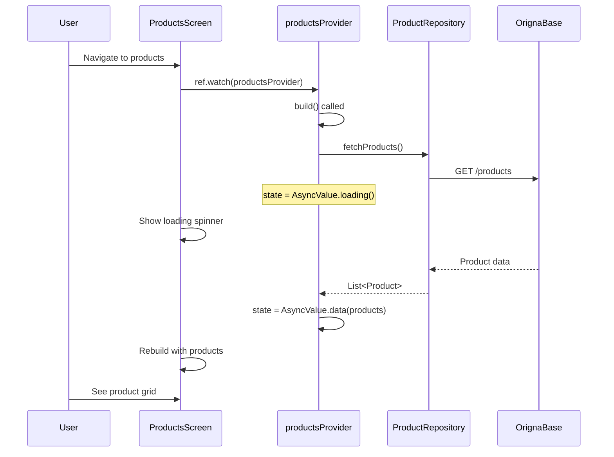
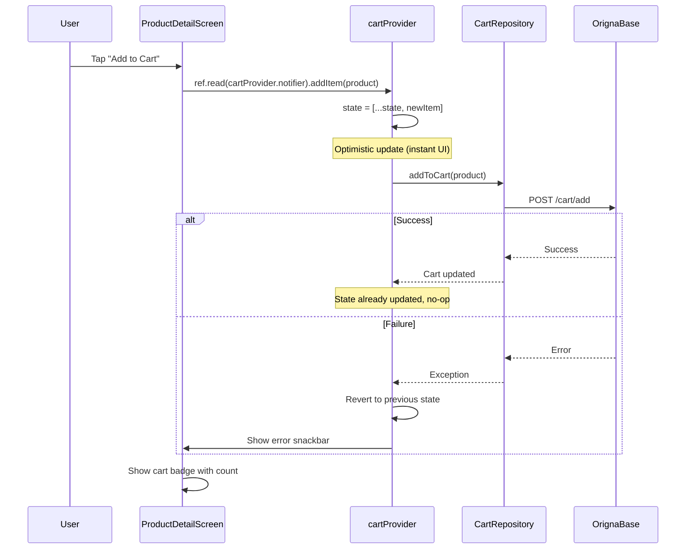
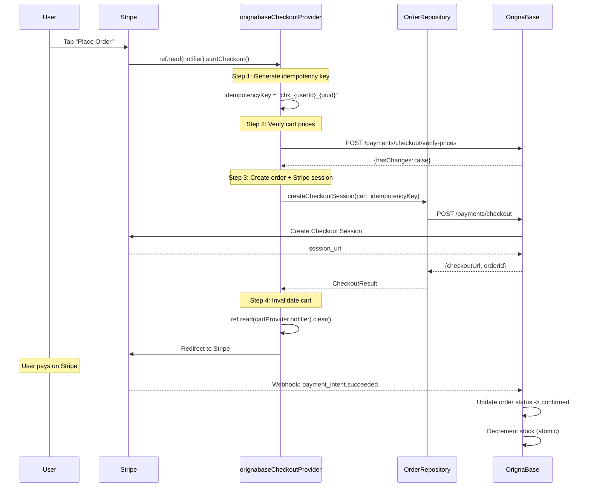

# ViewModels Reference

> **Architecture**: ViewModels are the brain of MVVM. They manage state, handle business logic, and coordinate between Screens (UI) and Services/Repositories (data).

---

## Overview

```
┌─────────────────────────────────────────────────────────┐
│                      SCREEN                              │
│  (UI only - no logic)                                   │
│  - Watches providers via ref.watch()                    │
│  - Dispatches actions via ref.read().notifier.method() │
│  - Displays AsyncValue states (data/loading/error)      │
└──────────────────────┬──────────────────────────────────┘
                       │ ref.watch() / ref.read()
                       ▼
┌─────────────────────────────────────────────────────────┐
│                   VIEWMODEL                              │
│  (State + Logic)                                        │
│  - Extends AsyncNotifier<T> or StateNotifier<T>        │
│  - Exposes state via build() method                     │
│  - Handles actions via public methods                   │
│  - Calls Repositories for data                         │
│  - Manages loading/error states                        │
└──────────────────────┬──────────────────────────────────┘
                       │ Repository calls
                       ▼
┌─────────────────────────────────────────────────────────┐
│                   REPOSITORY                             │
│  (Data Access)                                          │
│  - CRUD operations                                      │
│  - API calls via OrignaBase SDK                        │
│  - Data transformation                                  │
└─────────────────────────────────────────────────────────┘
```

---

## ViewModel Catalog

### Authentication ViewModels

| ViewModel | Provider | State Type | Responsibility |
|-----------|----------|------------|----------------|
| `AuthNotifier` | `authProvider` | `User?` | Current user state, login/logout |
| `LoginViewModel` | `loginViewModelProvider` | `LoginState` | Login form validation, submit |
| `RegisterViewModel` | `registerViewModelProvider` | `RegisterState` | Registration form, validation |
| `MfaViewModel` | `mfaViewModelProvider` | `MfaState` | MFA verification flow |

### Product ViewModels

| ViewModel | Provider | State Type | Responsibility |
|-----------|----------|------------|----------------|
| `ProductsNotifier` | `productsProvider` | `List<Product>` | Product list, pagination |
| `ProductDetailNotifier` | `productDetailProvider(id)` | `Product?` | Single product detail |
| `AddProductViewModel` | `addProductViewModelProvider` | `AddProductState` | Product creation form |
| `EditProductViewModel` | `editProductViewModelProvider(id)` | `EditProductState` | Product editing |
| `SellerProductsNotifier` | `sellerProductsProvider` | `List<Product>` | Seller's product list |

### Cart ViewModels

| ViewModel | Provider | State Type | Responsibility |
|-----------|----------|------------|----------------|
| `CartNotifier` | `cartProvider` | `List<CartItem>` | Cart items, add/remove/update |
| `CartTotalNotifier` | `cartTotalProvider` | `CartTotal` | Calculated totals |

### Checkout ViewModels

| ViewModel | Provider | State Type | Responsibility |
|-----------|----------|------------|----------------|
| `CheckoutNotifier` | `checkoutProvider` | `CheckoutState` | Checkout flow, validation |
| `OrignaBaseCheckoutNotifier` | `orignabaseCheckoutProvider` | `CheckoutState` | Stripe integration, idempotency |
| `ShippingCalculatorNotifier` | `shippingCalculatorProvider` | `ShippingCost` | Shipping cost calculation |

### Order ViewModels

| ViewModel | Provider | State Type | Responsibility |
|-----------|----------|------------|----------------|
| `OrdersNotifier` | `ordersProvider` | `List<Order>` | User orders list |
| `OrderDetailNotifier` | `orderDetailProvider(id)` | `Order?` | Single order detail |
| `SellerOrdersNotifier` | `sellerOrdersProvider` | `List<Order>` | Seller's orders |
| `OrderTrackingNotifier` | `orderTrackingProvider(id)` | `TrackingInfo` | Shipment tracking |

### Profile ViewModels

| ViewModel | Provider | State Type | Responsibility |
|-----------|----------|------------|----------------|
| `ProfileNotifier` | `profileProvider` | `UserProfile` | User profile data |
| `AddressNotifier` | `addressProvider` | `List<Address>` | Saved addresses |
| `EditAddressViewModel` | `editAddressViewModelProvider` | `EditAddressState` | Address form |

---

## State Management Patterns

### AsyncNotifier Pattern (Most Common)

Used for data that loads asynchronously from the backend.

```dart
/// Provider definition
final productsProvider = AsyncNotifierProvider<ProductsNotifier, List<Product>>(
  ProductsNotifier.new,
);

/// Notifier implementation
class ProductsNotifier extends AsyncNotifier<List<Product>> {
  @override
  Future<List<Product>> build() async {
    // Initial load - runs once when provider is first watched
    return _fetchProducts();
  }

  /// Public action methods
  Future<void> refresh() async {
    // Set loading state
    state = const AsyncValue.loading();
    // Fetch and update state
    state = await AsyncValue.guard(() => _fetchProducts());
  }

  Future<void> loadMore() async {
    // Pagination
    final currentProducts = state.valueOrNull ?? [];
    final newProducts = await _fetchProducts(offset: currentProducts.length);
    state = AsyncValue.data([...currentProducts, ...newProducts]);
  }

  /// Private helper
  Future<List<Product>> _fetchProducts({int offset = 0}) async {
    final repo = ref.read(productRepositoryProvider);
    return repo.fetchProducts(
      limit: BusinessRules.ordersPageSize,
      offset: offset,
    );
  }
}

/// Screen usage
class ProductsScreen extends ConsumerWidget {
  @override
  Widget build(BuildContext context, WidgetRef ref) {
    final productsAsync = ref.watch(productsProvider);

    return productsAsync.when(
      data: (products) => ProductsList(products),
      loading: () => const LoadingIndicator(),
      error: (e, st) => ErrorWidget(message: e.toString()),
    );
  }
}
```

### StateNotifier Pattern

Used for form state with multiple fields and validation.

```dart
/// State class (immutable, use freezed)
@freezed
class LoginState with _$LoginState {
  const factory LoginState({
    required String email,
    required String password,
    required bool isLoading,
    required String? errorMessage,
    required bool isValid,
  }) = _LoginState;

  factory LoginState.initial() => const LoginState(
    email: '',
    password: '',
    isLoading: false,
    errorMessage: null,
    isValid: false,
  );
}

/// Provider
final loginViewModelProvider = StateNotifierProvider<LoginViewModel, LoginState>(
  LoginViewModel.new,
);

/// ViewModel
class LoginViewModel extends StateNotifier<LoginState> {
  LoginViewModel(this.ref) : super(LoginState.initial());

  final Ref ref;

  /// Update email with validation
  void setEmail(String email) {
    state = state.copyWith(
      email: email,
      errorMessage: null,
      isValid: _validateForm(email: email, password: state.password),
    );
  }

  /// Update password with validation
  void setPassword(String password) {
    state = state.copyWith(
      password: password,
      errorMessage: null,
      isValid: _validateForm(email: state.email, password: password),
    );
  }

  /// Submit login
  Future<bool> submit() async {
    if (!state.isValid) return false;

    state = state.copyWith(isLoading: true, errorMessage: null);

    try {
      final auth = ref.read(authProvider.notifier);
      await auth.login(state.email, state.password);
      return true;
    } catch (e, st) {
      AppError.log(e, stackTrace: st, context: 'LoginViewModel.submit');
      state = state.copyWith(
        isLoading: false,
        errorMessage: AppError.getMessage(e, 'auth.login_failed'.tr()),
      );
      return false;
    }
  }

  bool _validateForm({required String email, required String password}) {
    return email.isNotEmpty && 
           email.contains('@') &&
           password.length >= 8;
  }
}
```

---

## State Flow Diagrams

### Product List Loading



### Add to Cart Flow



### Checkout Flow



---

## Error Handling Pattern

All ViewModels follow the same error handling pattern:

```dart
class ProductsNotifier extends AsyncNotifier<List<Product>> {
  @override
  Future<List<Product>> build() async {
    try {
      return await _fetchProducts();
    } catch (e, st) {
      // Log to Sentry
      AppError.log(
        e,
        stackTrace: st,
        context: 'ProductsNotifier.build',
      );
      
      // Re-throw to let AsyncValue handle it
      rethrow;
    }
  }

  Future<void> refresh() async {
    state = const AsyncValue.loading();
    
    // AsyncValue.guard catches errors automatically
    state = await AsyncValue.guard(() async {
      try {
        return await _fetchProducts();
      } catch (e, st) {
        AppError.log(
          e,
          stackTrace: st,
          context: 'ProductsNotifier.refresh',
        );
        rethrow;
      }
    });
  }
}

// Screen handles error state
class ProductsScreen extends ConsumerWidget {
  @override
  Widget build(BuildContext context, WidgetRef ref) {
    final productsAsync = ref.watch(productsProvider);

    return productsAsync.when(
      data: (products) => ProductsList(products),
      loading: () => const ModernLoadingIndicator(),
      error: (e, st) => Center(
        child: Column(
          children: [
            Text(AppError.getMessage(e, 'products.load_failed'.tr())),
            ModernButton(
              label: 'Retry',
              onPressed: () => ref.read(productsProvider.notifier).refresh(),
            ),
          ],
        ),
      ),
    );
  }
}
```

---

## Pagination Pattern

All list ViewModels use cursor-based pagination:

```dart
class ProductsNotifier extends AsyncNotifier<List<Product>> {
  String? _lastDocumentId;
  bool _hasMore = true;

  @override
  Future<List<Product>> build() async {
    return _fetchProducts();
  }

  Future<List<Product>> _fetchProducts({String? afterId}) async {
    final repo = ref.read(productRepositoryProvider);
    
    // Request pageSize + 1 to detect hasMore
    final result = await repo.fetchProducts(
      limit: 20,
      startAfterId: afterId,
    );

    // Update pagination state
    _lastDocumentId = result.lastDocumentId;
    _hasMore = result.hasMore;

    return result.products;
  }

  Future<void> loadMore() async {
    // Guard against duplicate loads
    if (!_hasMore || state.isLoading) return;

    final currentProducts = state.valueOrNull ?? [];
    if (currentProducts.isEmpty) return;

    // Show loading indicator at bottom
    state = AsyncValue.data([...currentProducts, ...[]]);

    try {
      final newProducts = await _fetchProducts(afterId: _lastDocumentId);
      state = AsyncValue.data([...currentProducts, ...newProducts]);
    } catch (e, st) {
      // Don't fail the whole list, just log and retry later
      AppError.log(e, stackTrace: st, context: 'ProductsNotifier.loadMore');
    }
  }
}

// Screen with infinite scroll
class ProductsScreen extends ConsumerStatefulWidget {
  @override
  ConsumerState<ProductsScreen> createState() => _ProductsScreenState();
}

class _ProductsScreenState extends ConsumerState<ProductsScreen> {
  final _scrollController = ScrollController();

  @override
  void initState() {
    super.initState();
    _scrollController.addListener(_onScroll);
  }

  void _onScroll() {
    if (_scrollController.position.pixels >=
        _scrollController.position.maxScrollExtent - 200) {
      // Trigger load when 200px from bottom
      ref.read(productsProvider.notifier).loadMore();
    }
  }

  @override
  Widget build(BuildContext context) {
    final productsAsync = ref.watch(productsProvider);

    return ListView.builder(
      controller: _scrollController,
      itemCount: productsAsync.valueOrNull?.length ?? 0,
      itemBuilder: (context, index) {
        // Render product cards
      },
    );
  }
}
```

---

## Common ViewModel Patterns

### 1. Form Validation

```dart
class AddProductViewModel extends StateNotifier<AddProductState> {
  AddProductViewModel(this.ref) : super(AddProductState.initial());

  void setName(String name) {
    state = state.copyWith(
      name: name,
      nameError: name.isEmpty ? 'Required' : null,
    );
    _validateForm();
  }

  void setPriceCents(int priceCents) {
    state = state.copyWith(
      priceCents: priceCents,
      priceError: priceCents <= 0 ? 'Must be positive' : null,
    );
    _validateForm();
  }

  void _validateForm() {
    state = state.copyWith(
      isValid: state.name.isNotEmpty &&
               state.priceCents > 0 &&
               state.categoryId != null,
    );
  }
}
```

### 2. Optimistic Updates

```dart
class CartNotifier extends AsyncNotifier<List<CartItem>> {
  Future<void> updateQuantity(String itemId, int newQuantity) async {
    // Store previous state for rollback
    final previousItems = state.valueOrNull ?? [];
    
    // Optimistic update
    state = AsyncValue.data(
      previousItems.map((item) {
        return item.id == itemId ? item.copyWith(quantity: newQuantity) : item;
      }).toList(),
    );

    try {
      // Sync with backend
      await ref.read(cartRepositoryProvider).updateQuantity(itemId, newQuantity);
    } catch (e, st) {
      // Rollback on failure
      state = AsyncValue.data(previousItems);
      AppError.log(e, stackTrace: st, context: 'CartNotifier.updateQuantity');
      rethrow;
    }
  }
}
```

### 3. Dependent Providers

```dart
// Product detail depends on product ID
final productDetailProvider = AsyncNotifierProvider.family<
  ProductDetailNotifier,
  Product?,
  String, // productId
>(ProductDetailNotifier.new);

class ProductDetailNotifier extends FamilyAsyncNotifier<Product?, String> {
  @override
  Future<Product?> build(String productId) async {
    final repo = ref.watch(productRepositoryProvider);
    return repo.fetchProductById(productId);
  }

  Future<void> refresh() async {
    state = const AsyncValue.loading();
    state = await AsyncValue.guard(() async {
      final repo = ref.read(productRepositoryProvider);
      return repo.fetchProductById(arg); // 'arg' is the productId
    });
  }
}

// Usage
class ProductDetailScreen extends ConsumerWidget {
  final String productId;

  const ProductDetailScreen({required this.productId});

  @override
  Widget build(BuildContext context, WidgetRef ref) {
    // Pass productId to provider
    final productAsync = ref.watch(productDetailProvider(productId));

    return productAsync.when(
      data: (product) => ProductDetailContent(product),
      loading: () => const LoadingIndicator(),
      error: (e, st) => ErrorWidget(message: e.toString()),
    );
  }
}
```

---

## Testing ViewModels

### Unit Test Example

```dart
// test/unit/products_viewmodel_test.dart
import 'package:flutter_test/flutter_test.dart';
import 'package:mocktail/mocktail.dart';
import 'package:flutter_riverpod/flutter_riverpod.dart';

class MockProductRepository extends Mock implements ProductRepository {}

void main() {
  late MockProductRepository mockRepo;
  late ProviderContainer container;

  setUp(() {
    mockRepo = MockProductRepository();
    container = ProviderContainer(
      overrides: [
        productRepositoryProvider.overrideWithValue(mockRepo),
      ],
    );
  });

  tearDown(() {
    container.dispose();
  });

  group('ProductsNotifier', () {
    test('build() fetches initial products', () async {
      // Arrange
      final mockProducts = [
        Product(id: '1', name: 'Product 1', priceCents: 1000),
        Product(id: '2', name: 'Product 2', priceCents: 2000),
      ];
      when(() => mockRepo.fetchProducts(limit: any(named: 'limit')))
          .thenAnswer((_) async => mockProducts);

      // Act
      final notifier = container.read(productsProvider.notifier);
      await notifier.build();

      // Assert
      final state = container.read(productsProvider);
      expect(state.value, equals(mockProducts));
      verify(() => mockRepo.fetchProducts(limit: 20)).called(1);
    });

    test('refresh() reloads products', () async {
      // Arrange
      when(() => mockRepo.fetchProducts(limit: any(named: 'limit')))
          .thenAnswer((_) async => []);

      // Act
      final notifier = container.read(productsProvider.notifier);
      await notifier.refresh();

      // Assert
      expect(container.read(productsProvider).isLoading, isFalse);
    });
  });
}
```

---

## Quick Reference

| Task | Pattern |
|------|---------|
| Load async data | `AsyncNotifier` + `build()` |
| Form state | `StateNotifier` + freezed state |
| Real-time updates | `StreamNotifier` |
| Family/provider with param | `FamilyAsyncNotifier` |
| Optimistic update | Update state first, sync second |
| Error handling | `AsyncValue.guard()` + `AppError.log()` |
| Pagination | Cursor-based + `hasMore` flag |

---

*Last updated: 2026-03-25 | Source: `lib/features/*/viewmodel.dart`*
