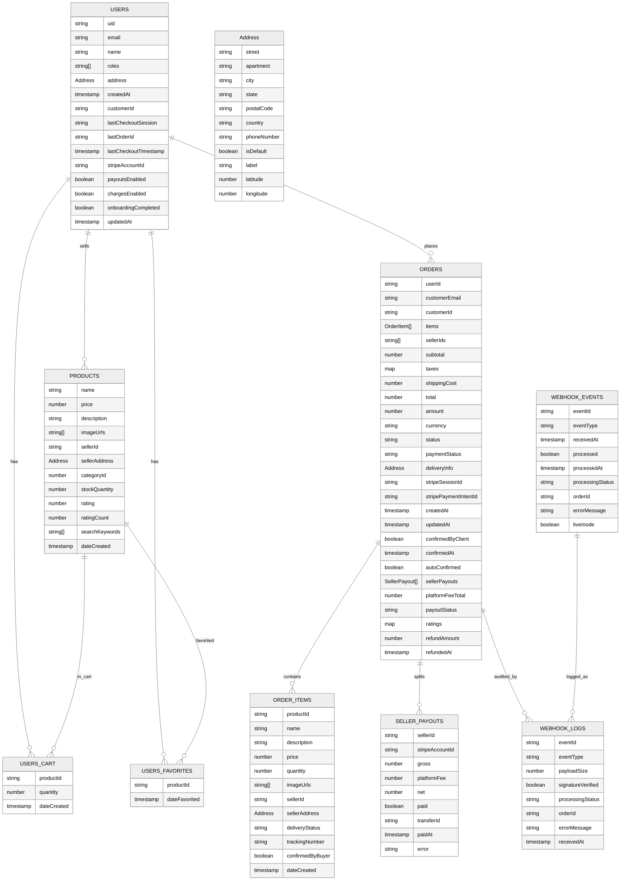

# OrignaGTA Firestore Database Diagram

> Visualized schema based on docs/database_schema.json

```mermaid
%%{init: {"theme": "neutral"}}%%
erDiagram
  USERS ||--o{ USERS_CART : has
  USERS ||--o{ USERS_FAVORITES : has
  USERS ||--o{ ORDERS : places
  USERS ||--o{ PRODUCTS : sells
  PRODUCTS ||--o{ USERS_CART : in_cart
  PRODUCTS ||--o{ USERS_FAVORITES : favorited
  ORDERS ||--o{ ORDER_ITEMS : contains
  ORDERS ||--o{ SELLER_PAYOUTS : splits
  ORDERS ||--o{ WEBHOOK_LOGS : audited_by
  WEBHOOK_EVENTS ||--o{ WEBHOOK_LOGS : logged_as

  USERS {
    string uid
    string email
    string name
    string[] roles
    Address address
    timestamp createdAt
    string customerId
    string lastCheckoutSession
    string lastOrderId
    timestamp lastCheckoutTimestamp
    string stripeAccountId
    boolean payoutsEnabled
    boolean chargesEnabled
    boolean onboardingCompleted
    timestamp updatedAt
  }

  USERS_CART {
    string productId
    number quantity
    timestamp dateCreated
  }

  USERS_FAVORITES {
    string productId
    timestamp dateFavorited
  }

  PRODUCTS {
    string name
    number price
    string description
    string[] imageUrls
    string sellerId
    Address sellerAddress
    number categoryId
    number stockQuantity
    number rating
    number ratingCount
    string[] searchKeywords
    timestamp dateCreated
  }

  ORDERS {
    string userId
    string customerEmail
    string customerId
    OrderItem[] items
    string[] sellerIds
    number subtotal
    map taxes
    number shippingCost
    number total
    number amount
    string currency
    string status
    string paymentStatus
    Address deliveryInfo
    string stripeSessionId
    string stripePaymentIntentId
    timestamp createdAt
    timestamp updatedAt
    boolean confirmedByClient
    timestamp confirmedAt
    boolean autoConfirmed
    SellerPayout[] sellerPayouts
    number platformFeeTotal
    string payoutStatus
    map ratings
    number refundAmount
    timestamp refundedAt
  }

  ORDER_ITEMS {
    string productId
    string name
    string description
    number price
    number quantity
    string[] imageUrls
    string sellerId
    Address sellerAddress
    string deliveryStatus
    string trackingNumber
    boolean confirmedByBuyer
    timestamp dateCreated
  }

  SELLER_PAYOUTS {
    string sellerId
    string stripeAccountId
    number gross
    number platformFee
    number net
    boolean paid
    string transferId
    timestamp paidAt
    string error
  }

  WEBHOOK_LOGS {
    string eventId
    string eventType
    number payloadSize
    boolean signatureVerified
    string processingStatus
    string orderId
    string errorMessage
    timestamp receivedAt
  }

  WEBHOOK_EVENTS {
    string eventId
    string eventType
    timestamp receivedAt
    boolean processed
    timestamp processedAt
    string processingStatus
    string orderId
    string errorMessage
    boolean livemode
  }

  Address {
    string street
    string apartment
    string city
    string state
    string postalCode
    string country
    string phoneNumber
    boolean isDefault
    string label
    number latitude
    number longitude
  }
```
