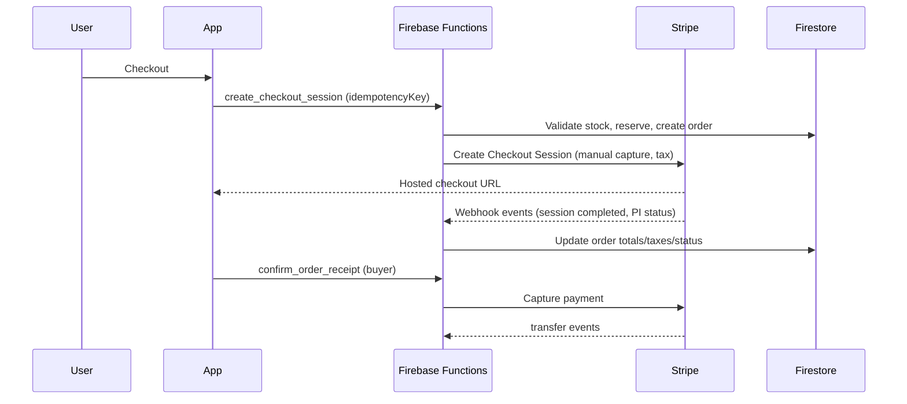

#+#+#+#+ origna_gta (Flutter app)

Canada-only marketplace app (Web, Android, iOS) using Firebase + Stripe Connect Express.

## Architecture (MVVM)
- UI → ViewModels → Repositories → Firebase/Stripe services
- No business logic in widgets
- Idempotent payments + defensive validation

## App flow diagram

## Setup
1. Flutter: `flutter pub get`
2. Run app: `flutter run`
3. Tests: `../scripts/run_all_tests.sh`

## Stripe Connect (direct charges)
- Manual capture authorization
- Capture after shipment/receipt confirmation
- Platform fee: 2.5%

## Stripe test cards
- 4242 4242 4242 4242 (success)
- 4000 0000 0000 9995 (insufficient funds)
- 4000 0000 0000 0002 (generic decline)
- 4000 0025 0000 3155 (3DS required)

Use any future expiry, any CVC, any postal code.

## Future hardening
- Validate multi-seller shipping math with mixed delivery options.
- Add full checkout E2E tests.
- Expand threat-model tests for cart/checkout abuse.

